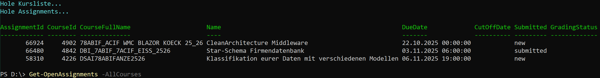
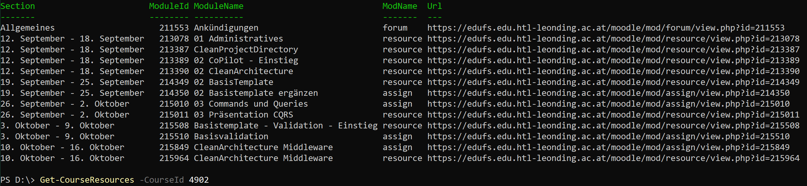
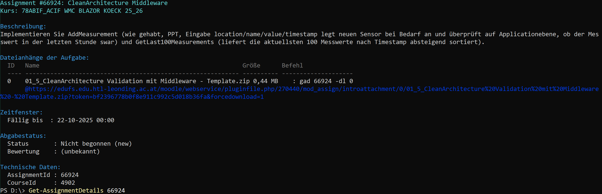

<!-- markdownlint-disable MD033 -->

### 1. 📎 Angabe

$${\LARGE{\texttt {\color{royalblue}\underline{{\quad {WMC 05 CleanArchitecture Middleware}\quad}}}}}$$
 

- **1.1.** [🌐 Moodle Assignment](https://edufs.edu.htl-leonding.ac.at/moodle/mod/assign/view.php?id=215849)

- **1.2.** 👨🏼‍🏫💬 **Aufgabenstellung** des Professors:
   > *Implementieren Sie AddMeasurement (wie gehabt, PPT, Eingabe location/name/value/timestamp legt neuen Sensor bei Bedarf an und überprüft auf Applicationebene, ob der Messwert in der letzten Stunde swar) und GetLast100Measurements (liefert die aktuellsten 100 Messwerte nach Timestamp absteigend sortiert).*

---

#### 2. 📝 Refinement der Aufgabe

- **2.1. Refined-Assignment**
  - **`AddMeasurement`** :
    - Neuer `Sensor` wird bei Bedarf angelegt
    - Auf Application-Ebene → Alter des Messwerts prüfen:
      `Timestamp < DateTime.UtcNow.AddHours(-1)`

  - **`GetLastHundredMeasurements`** :
    - Aktuellsten 100 Messwerte nach `Timestamp` absteigend sortiert

- **2.2. Refined-Skriptum**
  - [📝 Refined-Scriptum — № *5* $_{\texttt{\color{yellowgreen}{(.md)}}}$](scriptum_wmc_05_jan.md)
  - [📄 Refined-Scriptum — № *5* $_{\texttt{\color{darkgray}{(.pdf)}}}$](scriptum_wmc_05_jan.pdf)
  
 

#### 3. ⚡ Hinweise

- **3.1.** Fällig bis: ${\texttt{\underline{\color{red}{ 21.10.2025 23:59} }}}$

- **3.2.** Original-Anhänge zur Aufgabe:
  > - **A.** [CleanArchitecture Validation mit Middleware $_{\texttt{\color{darkgray}{(.zip)}}}$](<CleanArchitecture Validation mit Middleware - Template.zip>)
  > - **B.** [Basis Template Validation Middleware $_{\texttt{\color{darkgray}{(.pptx)}}}$](Basis-Template-Validation-Middleware.pptx)

---

#### 4. 🧙🏻‍♂️ ${\underline{ \color{royalblue}\texttt { Jan´s Moodle Wizard }}}$
  
  > - `MW`/`Moodle-Wizard`
  >   
  > - `GOA`/`Get-OpenAssignments` `-AllCourses`
  >   
  > - `GCR`/`Get-CourseResources` `-CourseId 4902`
  >   
  > - `GAD`/`Get-AssignmentDetails` `-AssignmentId 66924`
  >   

