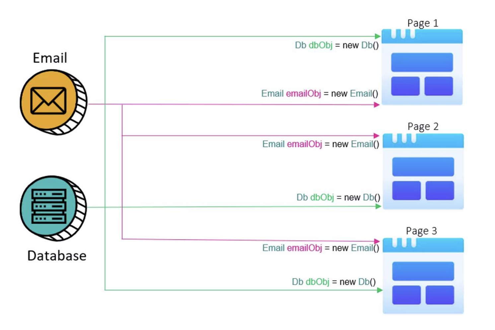
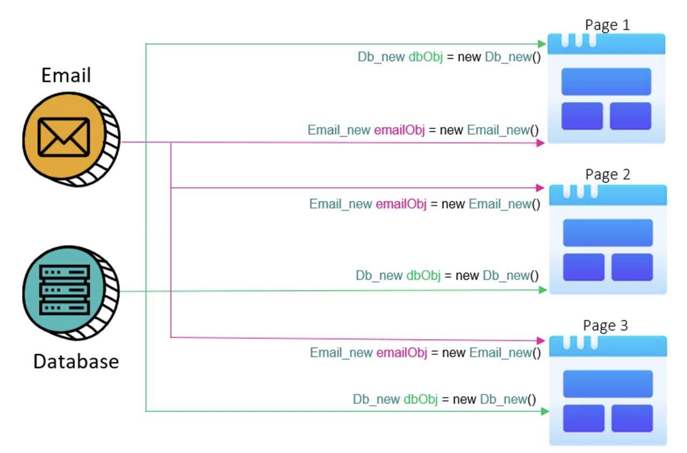
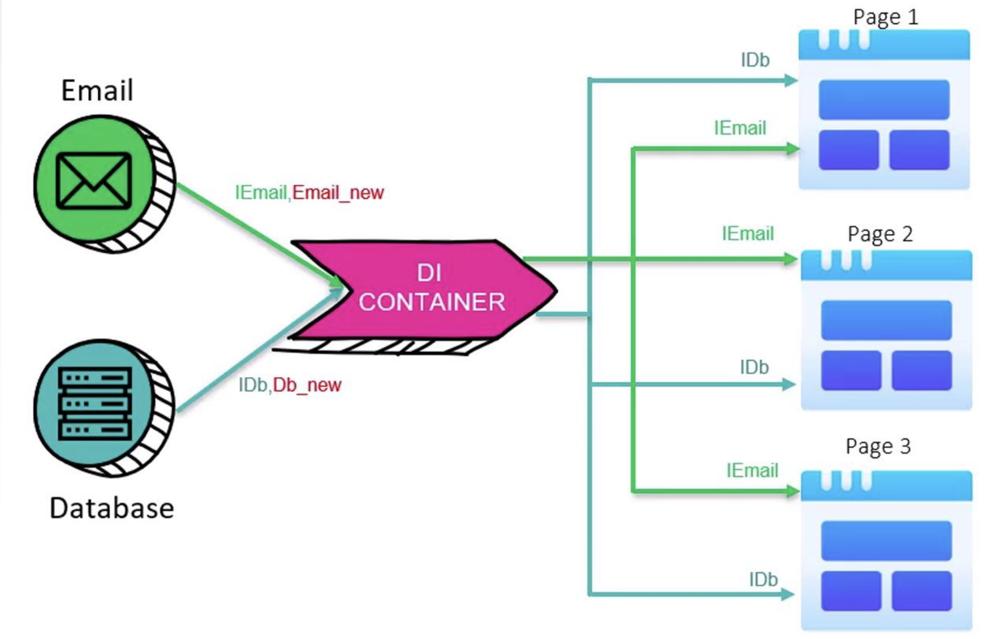
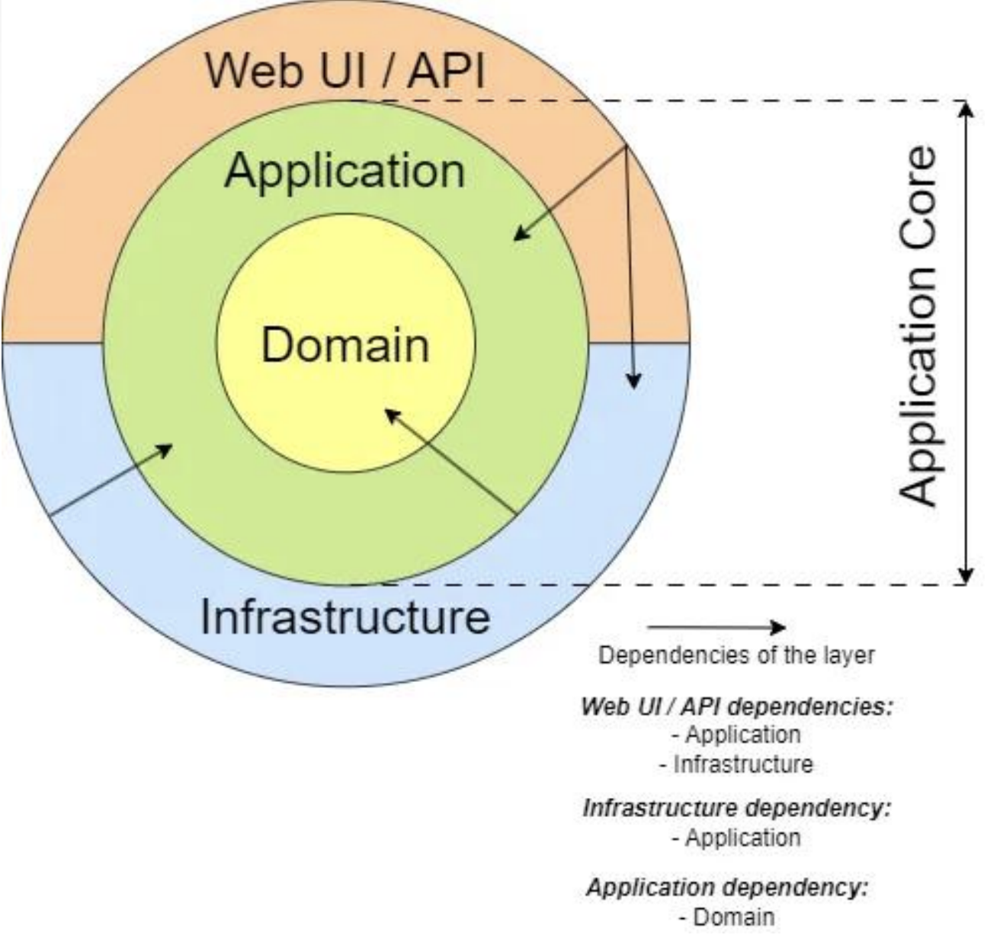
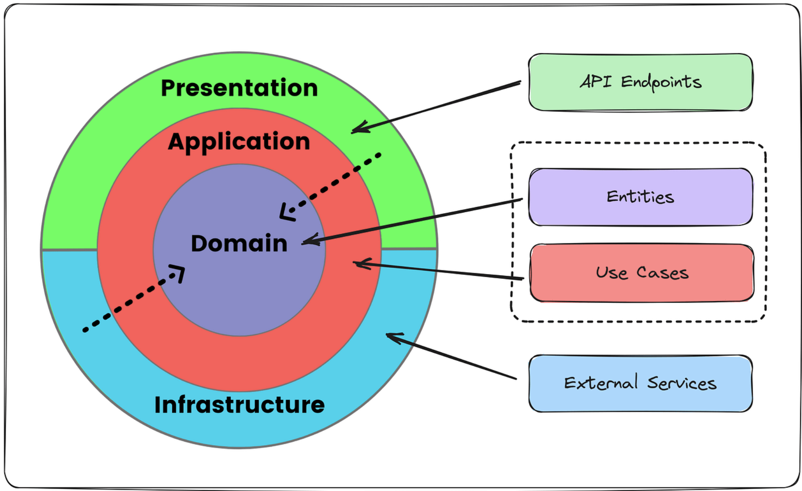
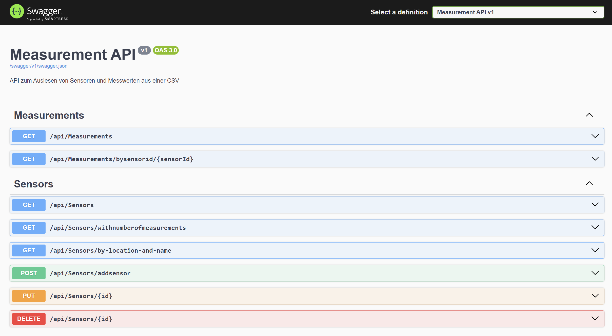

<!-- markdownlint-disable MD033 -->

<div style="page-break-after: always;">

## 1. Basis-Template für Blazor-Apps

- ### 1.1. Basierend auf anerkannten Pattern

  - **Clean-Architecture**

  - **UnitOfWork/Repository-Pattern**

  - **CQRS und Mediator-Pattern**

- ### 1.2. OO-Basisprogrammiertechniken

  - **SOLID**

  - **DRY**

    - Don‘t repeat yourself

  - Verwendung **Tests** zur Qualitätssicherung

---

## 2. SOLID – wartbar und sauber

- ### 2.1. S - Single Responsibility Principle (SRP)

  - Eine Klasse sollte nur eine einzige Verantwortung haben

- ### 2.2. O - Open/Closed Principle (OCP)

  - Neue Funktionalität soll durch Erweiterung, nicht durch Änderung des bestehenden Codes umgesetzt werden.

- ### 2.3. L - Liskov Substitution Principle (LSP)

  - Objekte einer abgeleiteten Klasse sollen sich so verhalten, dass sie überall als Objekte der Basisklasse einsetzbar sind.

- ### 2.4. I - Interface Segregation Principle (ISP)

  - Viele kleine, spezifische Schnittstellen sind besser als eine große, allgemeine.

- ### 2.5. D - Dependency Inversion Principle (DIP)

  - Abhängigkeiten sollen über Abstraktionen (Interfaces) definiert werden, nicht über konkrete Implementierungen.

---
</div>
<div style="page-break-after: always;">

## 3. Dependency Injection

### Ohne Dependency Injection

- **Ohne DI** ➔ Services werden bei Verwendung erzeugt

  - Abhängigkeit von konkreter Implementierung

<div align="center">
  
</div>

---

### 4. Mit Dependency Injection

- **Änderung der Service-Klasse** ➔ Änderung des Codes nötig

<div align="center">
  
</div>

---
</div>
<div style="page-break-after: always;">

### 5. Dependency Injection eines Services

- **Injektion des erzeugten Services**

  - Basis sind meist entsprechende „Verträge“

<div align="center">
  
</div>

---

### 6. Dependency Injection - Kompatibilität

- **Keine Codeänderung notwendig**

  - Solange Interface kompatibel bleibt

<div align="center">
  
</div>

---
</div>
<div style="page-break-after: always;">

## 7. Abhängigkeiten

<div align="center">
  
</div>

---

## 8. Beispiel WebApi

<div align="center">
  
</div>

---
</div>
<div style="page-break-after: always;">

## 9. Domain-Layer

- Basis-Entities mit Id und RowVersion

- Domain-Entities

- Notwendige Contracts (Interfaces) für Business-Logik

- Validierungen, die auf Geschäftslogik beruhen

  - Beispiel: Maximaler Rabatt ist abhängig vom bisherigen Umsatz
  
  - Häufig: Sichern Konsistenz in Datenbank

---

## 10. `BaseEntity`

```csharp
public abstract class BaseEntity : IBaseEntity
{
  /// <summary>
  /// Primärschlüssel (Identity).
  /// Protected set, damit nur EF/abgeleitete Klassen setzen können.
  /// </summary>
  public int Id { get; protected set; }
  
  /// <summary>
  /// Concurrency-Token (RowVersion).
  /// EF setzt diesen Wert bei jeder Anderung.
  /// Dient zur Erkennung konkurrierender Updates.
  /// </summary>
  [Timestamp]
  public byte[] RowVersion { get; set; } = [];
}
```

---

## 11. Beispiel-Entity: `Sensor`

```csharp
public class Sensor : BaseEntity
{
  private Sensor() { } // Für EF Core notwendig (parameterloser Konstruktor)
  
  /// <summary> Standort/Ort des Sensors, z.B. "Wohnzimmer". </summary>
  public string Location { get; private set; } = string.Empty;
  
  /// <summary> Anzeigename des Sensors, z.B. "Temperatur". </summary>
  public string Name { get; private set; } = string.Empty;
  
  public ICollection<Measurement> Measurements { get; set; } = default!;
}
```

---
</div>
<div style="page-break-after: always;">

## 12. Application-Layer

- Use-Cases der Anwendung

- Im einfachsten Fall CRUD

  - Interfaces für die Persistence ➔ Abstraktion nicht Implementierung
  
- Ablauf gibt die Validierung vor (nicht Zustand des Entities)
  
  - Beispiel: Ein Benutzer kann sein Passwort nur ändern, wenn er das alte Passwort korrekt eingegeben hat
  
- Häufig: Validierung von DTOs

---

## 13. Infrastructure-Layer

- Implementierungen der Services

  - Persistenz

  - CSV-Reader

  - Seeding

  - …

- Methode für UI: Registrierung der Services

---

## 14. Infrastructure - Überblick

```file-tree [Infrastructure-Projekt-Struktur]
◢🗃️ Infrastructure.csproj
  ├─▹📚 Dependencies
  ├─◢📂 Persistence
  │   ├─◢📂 Migrations
  │   │   ├─▹📄 20250922122859_InitialMigratior.cs
  │   │   └─▹📄 AppDbContextModelSnapshot.cs
  │   ├─◢📂 Repositories
  │   │   ├─▹📄 GenericRepository.cs
  │   │   ├─▹📄 MeasurementRepository.cs
  │   │   ├─▹📄 SensorRepository.cs
  │   │   └─▹📄 AppDbContext.cs
  │   └──▹📄 UnitOfWork.cs
  ├─◢📂 Services
  │   └─▹📄 StartupDataSeeder.cs
  └─▹📄 DependencyInjection.cs
```

<!-- 

  ```file-tree [<Part>-Projekt-Struktur]
  ◢🗃️ <Project>.csproj
    ├─▹🔌 Connected Services
    ├─▹📚 Dependencies
    ├─▹🔧 Properties
    ├─▹⚙️ appsettings.json
    ├─○🌐 Api.http
    ├─○🗄️ measurements.csv
    ├─◢📂 <open>
    │ ├─▹📄 <Class>.cs
    │ └─▹📄 <Class>.cs
    ├─▹📁 <closed>
    └─▹📑 Program.cs
  ```
  
  emojis:
    🗂️ 
    📦 
    📃 
    🗒️ 
    📜 
    💻 
    🖥️ 
  
  navigation:
    │ ├ └
  
  states:
    ▹▸ ▷▶ ◢◿ ⇲ →↓ ↔ 
  
  properties:
    ▪ ▫ ◻ ■ □ ● ◌ ○ • °৹ 

  -->

---
</div>
<div style="page-break-after: always;">

## 15. DI-Registrierung für Infrastruktur

- Wird in `Program.cs` (UI) aufgerufen

```csharp
public static IServiceCollection AddInfrastructure(
  this IServiceCollection services,
  string csvPath,
  string? connectionString = null)
{
  // Falls kein ConnectionString ubergeben, lokalen SQL Server Express verwenden
  connectionString ??= 
    "Server=(localdb)\\MSSQLLocalDB; Database=Iot; Trusted_Connection=True; MultipleActiveResultSets=true";
  
  services.AddDbContext<AppDbContext>(opt => opt.UseSqlServer(connectionString));

  // Repositories und UoW (Scoped: pro HTTP-Request eine Instanz)
  services.AddScoped<ISensorRepository, SensorRepository>();
  services.AddScoped<IMeasurementRepository, MeasurementRepository>();
  services.AddScoped<IUnitOfWork, UnitOfWork>();

  // Hosted Service zum initialen Datenimport beim Start der Anwendung
  //services. AddHostedService<StartupDataSeeder>();
  services.AddSingleton<IHostedService>(serviceProvider => new StartupDataSeeder(csvPath, serviceProvider));
                                          
  return services;
}
```

---

## 16. `StartupDataSeeder`

```csharp
public class StartupDataSeeder(string csvPath, IServiceProvider provider) : IHostedService
{
  private readonly string _csvPath = csvPath;
  private readonly IServiceProvider _provider = provider;
  private readonly SemaphoreSlim _lock = new(1, 1);

  public async Task StartAsync(CancellationToken cancellationToken)
  {
    using var scope = _provider.CreateScope();
    var ctx = scope.ServiceProvider
                   .GetRequiredService<AppDbContext>();
    await ctx.Database.MigrateAsync(cancellationToken);

    // Nur seeden, wenn noch keine Sensoren existieren (idempotent)
    if (await ctx.Sensors.AnyAsync(cancellationToken))
      return;

    var allMeasurements = await ReadMeasurementsFromCsv(cancellationToken);
    ctx.Measurements.AddRange(allMeasurements);

    await ctx.SaveChangesAsync(cancellationToken);
  }
}
```

---
</div>
<div style="page-break-after: always;">

### 17. Migration

- **CLI-Tools installieren**

  - `dotnet tool install –global dotnet-ef`

- **CLI**

  - `dotnet ef migrations add InitialMigration --project ./Infrastructure --startup-project ./Api --output-dir`

  - `dotnet ef database update --project ./Infrastructure --startup-project ./Api`

- **Package-Manager Console**

  - Default project: Infrastructure, Startup project: Api

  - `Add-Migration InitialMigration`

  - `Update-Database`

---

## 18. `UnitOfWork` - `IUnitOfWork` & `IDisposable`

```csharp
public class UnitOfWork : IUnitOfWork, IDisposable
{
  private readonly AppDbContext _ctx;
  private bool _disposed;

  /// <summary> Zugriff auf Sensor-Repository. </summary>
  public ISensorRepository Sensors { get; }

  /// <summary> Zugriff auf Measurement-Repository. </summary>
  public IMeasurementRepository Measurements { get; }

  public UnitOfWork(AppDbContext ctx, 
                    ISensorRepository sensors,
                    IMeasurementRepository measurements)
  {
    _ctx = ctx;
    Sensors = sensors;
    Measurements = measurements;
  }

  /// <summary>
  /// Persistiert alle Änderungen in die DB.
  /// Gibt die Anzahl der betroffenen Zeilen zurück.
  /// </summary>
  public Task<int> SaveChangesAsync(CancellationToken ct = default)
    => _ctx.SaveChangesAsync(ct);
}
```

---
</div>
<div style="page-break-after: always;">

## 19. Generic Repository

```csharp
public class GenericRepository<T> : IGenericRepository<T> where T : class, IBaseEntity
{
  protected readonly AppDbContext _ctx;
  protected readonly DbSet<T> _set;
  
  public GenericRepository(AppDbContext ctx)
  {
    _ctx = ctx;
    _set = ctx.Set<T>();
  }
}
```

---

## 20. Generische Get-Methoden

```csharp
/// <summary> Holt eine Entität per Primärschlüssel.
public virtual async Task<T?> GetByIdAsync(int id, CancellationToken ct = default)
  => await _set.FindAsync([id], ct);

/// <summary> Holt alle Entitäten (optional gefiltert und sortiert). NoTracking
public virtual async Task<IReadOnlyCollection<T>> GetAllAsync(
  CancellationToken ct = default,
  Func<IQueryable<T>, IOrderedQueryable<T>>? orderBy = null,
  Expression<Func<T, bool>>? filter = null)
{
  IQueryable<T> query = _set.AsNoTracking();

  if (filter is not null)
    query = query.Where(filter);

  if (orderBy is not null)
    query = orderBy(query);

  return await query.ToListAsync(ct);
}
```

---
</div>
<div style="page-break-after: always;">

## 21. Generische Änderungsmethoden

```csharp
/// <summary> Fügt eine neue Entität hinzu (noch nicht gespeichert). </summary>
public virtual async Task AddAsync(T entity, CancellationToken ct = default)
  => await _set.AddAsync(entity, ct);

/// <summary> Fügt mehrere neue Entitäten hinzu (noch nicht gespeichert). </summary>
public virtual async Task AddRangeAsync(IEnumerable<T> entities, CancellationToken ct = default)
  => await _set.AddRangeAsync(entities, ct);

/// <summary> Markiert eine Entität als geändert. </summary>
public virtual void Update(T entity)
  => _set.Update(entity);

/// <summary> Entfernt eine Entität. </summary>
public virtual void Remove(T entity)
  => _set.Remove(entity);

/// <summary> Entfernt mehrere Entitäten. </summary>
public virtual void RemoveRange(IEnumerable<T> entities) 
  => _set.RemoveRange(entities);
```

---

## 22. `Repository` wird schlanker

```csharp
/// <summary> Findet einen Sensor anhand von Standort und Name. </summary>
public async Task<Sensor?> GetByLocationAndNameAsync(string location, 
                                                     string name,
                                                     CancellationToken ct = default)
  => await _ctx.Sensors
               .FirstOrDefaultAsync(s => s.Location == location
                                      && s.Name == name, ct);

///// <summary>
///// Überschreibt GetAllAsync, um die Sensoren konsistent sortiert zuruckzugeben.
///// </summary>
//public override async Task<IReadOnlyCollection<Sensor>> GetAllAsync( 
//  CancellationToken ct = default,
//  Func<IQueryable<Sensor>,
//  IOrderedQueryable<Sensor>>? orderBy = null,
//  Expression<Func<Sensor, bool>>? filter = null)
//    => await (orderBy is null
//              ? _ctx.Sensors
//                    .AsNoTracking()
//                    .WhereIf(filter)
//                    .OrderBy(s => s.Location)
//                    .ThenBy(s => s. Name)
//              : orderBy(_ctx. Sensors
//                            .AsNoTracking()
//                            .WhereIf(filter)))
//              .ToListAsync(ct);
```

---
</div>
<div style="page-break-after: always;">

## 23. Presentation-Layer

- UI-der Anwendung

  - WPF-View in Windows-Anwendungen

  - HTML-View mit CSS und JS in Webanwendungen

  - Swagger-UI für API

- Validierungen der Benutzereingabe

  - Korrektes Format, …

---

## 24. Swagger-UI - Measurement API

<div align="center">
  
</div>

---

## 25. `Swagger` direkt starten

```json
{
  "$schema": "https://json.schemastore.org/launchsettings.json",
  "profiles": {
    "http": {
      "commandName": "Project",
      "dotnetRunMessages": true,
      "launchBrowser": false,
      "applicationUrl": "http://localhost:5186",
      "environmentVariables" : {
        "ASPNETCORE_ENVIRONMENT": "Development"
      },
      "launchUrl": "swagger"
    }
  }
}
```

---
</div>
<div style="page-break-after: always;">

## 26. `SensorsController` – SRP

- Aufgabe des Controllers?

```csharp
/// <summary> Endpunkte rund um Sensoren.
[ApiController]
[Route("api/[controller]")]
public class SensorsController(IUnitOfWork uow) : ControllerBase
{
  /// <summary> Liefert alle Sensoren sortiert nach Location und Name.
  [HttpGet]
  [ProducesResponseType(typeof(IEnumerable<GetSensorDto>), StatusCodes.Status2000K)]
  public async Task<IActionResult> GetAll(CancellationToken ct)
  {
    var sensors = await uow.Sensors.GetAllAsync(ct,q => q.OrderBy(s => s.Location)
                                                       .ThenBy(s => s.Name));

    // Nur die Felder an den Client geben, die notig sind (ohne RowVersion)
    var dtos = sensors.Select(s => new GetSensorDto(s.Id, s.Location, s.Name));
    return Ok(dtos);
  }
}
```

---

## 27. `AddSensor` – SingleResponsabilityPrinciple

```csharp
[HttpPost("addsensor")]
[ProducesResponseType(typeof(GetSensorDto), StatusCodes.Status201Created)]
[ProducesResponseType(StatusCodes.Status400BadRequest)]
[ProducesResponseType(StatusCodes.Status409Conflict)]
public async Task<IActionResult> AddSensor([FromBody] CreateSensorRequestDto request, CancellationToken ct)
{
  if (request.Equals(default))
    return BadRequest("Request ist erforderlich.");
  
  var location = request.Location?.Trim();
  var name = request.Name?.Trim();
  
  if (string.IsNullOrWhiteSpace(location))
    return BadRequest("Location ist erforderlich.");
  
  if (string.IsNullOrWhiteSpace(name)|| name!.Length < 2)
    return BadRequest("Sensorname muss mindestens zwei Zeichen lang sein.");
  
  if (string.Equals(location, name,StringComparison.OrdinalIgnoreCase))
    return BadRequest("Sensorname darf nicht mit der Location ubereinstimmen.");
  
  var existing = await uow.Sensors .GetByLocationAndNameAsync(location, name, ct);
  
  if (existing is not null)
    return Conflict($"Sensor '{name}' an Location '{location}' existiert bereits.");
  
  var sensor = new Sensor(location, name);
  await uow.Sensors.AddAsync(sensor, ct);
  await uow.SaveChangesAsync(ct);
  
  return CreatedAtAction(nameof(GetAll), null, new GetSensorDto(sensor.Id, sensor.Location, sensor.Name));
}
```

</div>
<div style="page-break-after: always;">

## $\texttt{{\color{lightgreen}{28.} {\color{forestgreen}{Übung}}}~{\color{lightgreen}{- Ergänzung~Iot~App}}}$

- GetSensorByLocationAndName

- GetSensorsWithNumberOfMeasurements

- UpdateSensor

- DeleteSensor

- GetAllMeasurements ordered by TimeStamp desc

- GetMeasurementsBySensorId

  - Paging

---

### 29. Testen von `GetMeasurementsBySensorId`

Request:

```http
  GET http://localhost:7085/api/measurements/by-sensor-id/7?page=2&pageSize=10
  <!-- Accept: application/json -->
```

Response Body:

```json
[
  {
    "id": 101,
    "sensorId": 1,
    "value": 22.7,
    "timeStamp": "2025-09-30T08:15:30Z"
  },
  {
    "id": 102,
    "sensorId": 1,
    "value": 22.8,
    "timeStamp": "2025-09-30T08:16:30Z"
  }
]
```

Response Header:

```http
  Content-Type: application/json; charset=utf-8
  X-Total-Count: 42
  X-Page: 2
  X-Page-Size: 10
  X-Total-Pages: 3096
```

---
</div>
<div style="page-break-after: always;">

## 30. Paging-Info im Header

```http
  HTTP/1.1 200 OK
  Content-Type: application/json; charset=utf-8
  X-Total-Count: 42
  X-Page: 2
  X-Page-Size: 5
  X-Total-Pages: 9
  Link: <http://localhost:5186/api/measurements?sensorId=1&page=1&pageSize=5>; rel="first",
        <http://localhost:5186/api/measurements?sensorId=1&page=1&pageSize=5>; rel="prev",
        <http://localhost:5186/api/measurements?sensorId=1&page=3&pageSize=5>; rel="next",
        <http://localhost:5186/api/measurements?sensorId=1&page=9&pageSize=5>; rel="last"
  
  {
    "items": [ /* ... gekürzt ... */ ],
    "page": 2,
    "pageSize": 5,
    "total": 42,
    "totalPages": 9
  }
```

---

## 31. Abfrage am `SQL`-Server

- Query wird tatsächlich am Server ausgeführt

```shell
info: Microsoft. EntityFrameworkCore. Database. Command[20101]
      Executed DbCommand (29ms) [Parameters=[], CommandType='Text', CommandTimeout='30' ]
      SELECT [s] [Td] [s] [Location] [s][Name], (
          SELECT COUNT(*)
          FROM [Measurements] AS [m]
          WHERE [s]. [Id] = [m]. [SensorId])
      FROM [Sensors] AS [s]
      ORDER BY [s]. [Location], [s]. [Name]
```

---

## 29. Erweiterung der Architektur

- SRP für Controller ➔ verschlanken

  - CQRS-Pattern

- Mapping-Aufgaben über zentralen Mapper (Mapster)

- Validierung über Fluent-Validation

- Wer nachlesen will

  - [https://www.ezzylearning.net/tutorial/building-blazor-webassembly-apps-with-clean-architecture](https://www.ezzylearning.net/tutorial/building-blazor-webassembly-apps-with-clean-architecture)

---
</div>
<div style="page-break-after: always;">

## 33. `CQRS` - Command Query Responsibility Segregation

- Trennung der Lese- und Schreiboperationen einer Anwendung in **zwei strikt getrennte Modelle**

  - **Queries**

    - Reine Leseoperationen liefern DTOs

  - **Commands**

    - Datenänderungen

- Implementiert mehrere Entwurfsprinzipien

  - Single Responsability Principle aus SOLID

  - Separation of Concerns

  - Command-Pattern

    - Jeder Schreibzugriff ist ein eigener Befehl

---

## 34. Mediator-Pattern

- Zentraler Kommunikationsknoten zwischen Objekten

  - Lose Kopplung ➔ Objekte kennen nur Mediator

- Strukturierung der Requests

  - Je Aufgabe ein Handler, der dann vom Mediator aufgerufen wird

- Nachteil: Anwendung wirkt aufgebläht

  - Mehr Verzeichnisse und Dateien

  - Viel Boilerplate-Code

  - Bei kleinen Anwendungen ➔ viel Overhead

---

## 35. Application-Layer verwendet NuGet-Packages

```cs
<Project Sdk="Microsoft.NET.Sdk">

  <ItemGroup>
    <ProjectReference Include=" .. \Domain\Domain. csproj" />
  </ItemGroup>

  <ItemGroup>
    <PackageReference Include="FluentValidation" Version="12.0.0" />
    <PackageReference Include="Mapster" Version="7.4.0" />
    <PackageReference Include="MediatR" Version="13.0.0" />
  </ItemGroup>

  <PropertyGroup>
    <TargetFramework>net9.0</TargetFramework>
    <ImplicitUsings>enable</ImplicitUsings>
    <Nullable>enable</Nullable>
  </PropertyGroup>

</Project>
```

---
</div>
<div style="page-break-after: always;">

## 36. Queries - Controller

- SRP ➔ bleibt schlank

- Kernaufgabe: Request empfangen und Response zurücksenden

- Datenbeschaffung und Mapping geschieht woanders

  - Kann dann auch wiedreverwendet werden

```csharp
[HttpGet]
[ProducesResponseType(typeof(IEnumerable<GetSensorDto>), StatusCodes.Status2000K)]
public async Task<IActionResult> GetAll(CancellationToken ct)
{
  var dtos = await mediator.Send(new GetAllSensorsQuery(), ct);

  return Ok(dtos),
}
```

## 37. Queries - `MediatR`

- Daten aus DB laden ➔ UnitOfWork/Repository

- Schema bleibt ímmer gleich

```csharp
public record GetAllSensorsQuery 
  : IRequest<IReadOnlyCollection<GetSensorDto>>;

public class GetAllSensorsQueryHandler(IUnitOfWork uow) 
  : IRequestHandler<GetAllSensorsQuery, 
    IReadOnlyCollection<GetSensorDto>>
{
  public async Task<IReadOnlyCollection<GetSensorDto>> Handle(
    GetAllSensorsQuery request,
    CancellationToken cancellationToken)
  {
    var sensors = 
      await uow.Sensors
               .GetAllAsync(cancellationToken, 
                            orderBy: q => q.OrderBy(s => s.Location)
                                           .ThenBy(s => s. Name));
                                           
    return sensors.Adapt<IReadOnlyCollection<GetSensorDto>>();
  }
}
```

---

## 38. Command-Pattern im Detail

```csharp
public readonly record struct CreateSensorCommand(string Location, string Name)
  : IRequest<GetSensorDto>;
```

- Immutable Wertetyp ➔ keine defensive Kopie nötig

- Parameter des Records entsprechen genau dem DTO

- Rückgabetyp ist GetSensorDto

</div>
<div style="page-break-after: always;">

## 39. `CommandHandler` mit `Mapster`

```csharp
public class CreateSensorCommandHandler(IUnitOfWork uow)
  : IRequestHandler<CreateSensorCommand, GetSensorDto>
{
  public async Task<GetSensorDto> Handle(CreateSensorCommand request,
                                         CancellationToken cancellationToken)
  {
    var entity = new Sensor(request.Location, request.Name);

    await uow.Sensors.AddAsync(entity, cancellationToken);
    await uow.SaveChangesAsync(cancellationToken);
    
    return entity.Adapt<GetSensorDto>();
  }
}
```

---

## 40. Domain Driven Development

- Orientierung an der Businesslogik

- Domain steht mit ihren fachlichen Regeln im Mittelpunkt

  - Entities als zentrale Elemente entsprechen Busimnessobjekten

  - Value Object ohne eigene Identität aber mit eigenen Regeln

    - Adresse

  - Einhaltung der Regeln wird innerhalb des Entities garantiert

  - Domainservices prüfen Regeln die über Entitätsgrenzen hinausgehen

    - Z.B. Keine zwei Sensoren mit selben Namen und Location

---

## 41. Validation

- Prüft auf mehreren Ebenen, ob die Daten (Eingabe, Empfang, …) korrekt sind

  - Ebenen

    - Presentation Layer: Syntax, Eingabefehler, …

    - Use-Case: korrekt im Sinne des Anwendungsfalls

    - Domain: werden Businessrules eingehalten

    - Infrastructure: Regeln für die Abbildung auf DB

      - Unique-Indizes, String-Längen, Wertebereiche, …

  - Letztlich ist wichtig, dass keine fehlerhaften Daten persistiert werden

---
</div>
<div style="page-break-after: always;">

## 42. Validation auf mehreren Ebenen

- Domain-Regeln werden auch in höheren Ebenen verwendet ➔ DRY

  - Application, UI

- Unterscheidung

  - Entitäts-intern

    - Simple Unittests

  - Über Entitätsgrenzen

    - Komplexer

    - Z.B. keine Sensoren mit gleicher Location und gleichem Namen

    - Benötigen UOW-Zugriff

    - In UI (Browser) nicht sinnvoll wiederverwendbar

    ```text
    ╭──────────────────────────────────────────────╮
    │            PRESENTATION LAYER            │
    │          ( API, Controller, UI )         │
    │                                          │
    │  · Syntax-Checks (z.B. JSON valide?)     │
    │  · Pflichtfelder da?                     │
    │  · Formatvalidierung(z.B. Email Regex)   │
    ╰──────────────────────┬───────────────────────╯
                         ▼
    ╭──────────────────────────────────────────────╮
    │            APPLICATION LAYER             │
    │                                          │
    │  · Request Validation                    │
    │    (z.B. DTO Mapper, Eingabe-Boundaries) │
    │  · Orchestrierung                        │
    │    (richtiger Use Case?)                 │
    │  · Zugriffskontrolle                     │
    ╰──────────────────────┬───────────────────────╯
                         ▼
    ╭──────────────────────────────────────────────╮
    │               DOMAIN LAYER               │
    │                                          │
    │   · Geschäftslogik-Validierungen         │
    │     (Invarianten, Regeln)                │
    │     · Rabatt ≤ 20 %                      │
    │     · Konto darf nicht < 0               │
    │     · Bestellung nur, wenn Kunde aktiv   │
    ╰──────────────────────────────────────────────╯
    ```

## 43. Eigener Typ `ValidationResult`

- Mit Factory-Methods

  - Wozu?
  
  - Alternativen?

  ```csharp
  /// <summary> DomainValidationResult mit Factory-Methoden. </summary>
  public sealed record ValidationResult( bool IsValid , string? ErrMsg )
  {
    public static ValidationResult Success( ) => new( true , null );
    public static ValidationResult Failure( string msg ) => new( false , msg );
  }
  ```

---
</div>
<div style="page-break-after: always;">

## 44. Domain-Rules zentral verwalten

- Code syntaktisch und semantisch analysieren

```csharp
public static class SensorSpecifications
{
  public const int NameMinLength = 2;

  public static ValidationResult CheckLocation( string location )
  {
    if(string.IsNullOrWhiteSpace( location ))
      return ValidationResult.Failure( "Location darf nicht leer sein." );

    return ValidationResult.Success();
  }

  public static ValidationResult CheckName( string name )
    => (string.IsNullOrWhiteSpace( name ))
      ? ValidationResult.Failure( "Name darf nicht leer sein." )
      : name.Trim().Length < NameMinLength
        ? ValidationResult.Failure( $"Name muss mindestens {NameMinLength} Zeichen haben." )
        : ValidationResult.Success();

  public static ValidationResult CheckNameNotEqualToLocation( string name, string location )
    => string.Equals( name.Trim(), location.Trim(), StringComparison.OrdinalIgnoreCase )
      ? ValidationResult.Failure( "Name darf nicht der Location entsprechen." )
      : ValidationResult.Success();
}
```

## 45. Ohne Bedingungsoperator `? :` (Ternary Operator)

```csharp
public static ValidationResult CheckName( string name )
{
  if(string.IsNullOrWhiteSpace( name ))
    return ValidationResult.Failure( "Name darf nicht leer sein." );

  if(name.Trim().Length < NameMinLength)
    return ValidationResult.Failure( $"Name muss mindestens {NameMinLength} Zeichen haben." );

  return ValidationResult.Success();
}
```

## 46. Alle Prüfungen aufrufen

- Was hat es mit dem yield return auf sich?

```csharp
public static IEnumerable<ValidationResult> CheckAll( string location, string name )
{
  yield return CheckLocation( location );
  yield return CheckName( name );
  yield return CheckNameNotEqualToLocation( name, location );
}
```

---
</div>
<div style="page-break-after: always;">

## 47. Alternative zu `yield return`

- Unterschiede?

```csharp
public static IEnumerable<ValidationResult> CheckAll( string location, string name )
{
  var results = new List<ValidationResult>
  {
    CheckLocation( location ),
    CheckName( name ),
    CheckNameNotEqualToLocation( name, location )
  };
  return results;
}
```

## 48. Im Fehlerfall ➔ `DomainValidationException`

```csharp
namespace Domain.Exception;

/// <summary>
/// Exception thrown when domain validation fails.
/// </summary>
public class DomainValidationException(string message) 
  : Exception(message){ }
```

## 49. Entity sichert seinen validen Zustand ab

```csharp
/// <summary>
/// Creates a new Sensor.
/// Throws DomainValidationException if validation fails.
/// </summary>
public partial class Sensor(string location, string name)
{
  foreach(var result in SensorSpecifications.CheckAll(location, name))
  {
    if(!result.IsValid) 
      throw new DomainValidationException(result.ErrMsg);
  }
  Location = location;

  Name = name;
}
```

---
</div>
<div style="page-break-after: always;">

## 50. Validation greift, aber …

- **Wir wollen einen BadRequest ohne Stacktrace**

- **Curl** (Befehl abgeändert - *damit er in der Powershell 7 funktioniert*)

  ```powershell
  Invoke-RestMethod -Uri 'https://localhost:7085/api/Sensors' `
   -Method Post `
   -Headers @{
     'accept' = 'text/plain'
     'Content-Type' = 'application/json'
   } `
   -Body '{
   "location": "a",
   "name": "a"
  }'
  ```

- **Request URL**

  ```html
  https://localhost:7085/api/Sensors
  ```

- **Server response**

  | Code | Details |
  |:----:|:------- |
  | 500 <br> *Undocumented* | Error: response status is 500 |
  |      | **Response body** <br> `Domain. Exceptions.DomainValidationException: Name darf nicht der Location entsprechen.` ... |
  
---

## 51. Exception ➔ Responsecode 400

```csharp
public class CreateSensorCommandHandler(IUnitOfWork uow)
  : IRequestHandler<CreateSensorCommand, GetSensorDto>
{
  public async Task<GetSensorDto> Handle(CreateSensorCommand request, 
                                         CancellationToken cancellationToken)
  {
    var entity = new Sensor(request.Location, request.Name);

    await uow.Sensors.AddAsync(entity, cancellationToken);
    await uow.SaveChangesAsync(cancellationToken);

    return entity.Adapt<GetSensorDto>();
  }
}
```

---
</div>
<div style="page-break-after: always;">

## 52. Eine Möglichkeit - `CommandHandler`

```csharp
public async Task<CreateSensorResultDto> Handle(CreateSensorCommand request, 
                                                CancellationToken cancellationToken)
{
  try
  {
    var entity = new Sensor(request.Location, request.Name);

    await uow.Sensors.AddAsync(entity, cancellationToken);
    await uow.SaveChangesAsync(cancellationToken);

    return new CreateSensorResultDto(entity.Adapt<GetSensorDto>());
  }
  catch(Exception ex)
  {
    return new CreateSensorResultDto.Failure(ex.Message);
  }
}
```

---

## 53. Sieht doch schon besser aus

- **Curl** (Befehl abgeändert - *damit er in der Powershell 7 funktioniert*)

  ```powershell
  Invoke-RestMethod -Uri 'https://localhost:7085/api/Sensors' `
    -Method Post `
    -Headers @{
      'accept' = 'text/plain'
      'Content-Type' = 'application/json'
    } `
    -Body '{
    "location": "string",
    "name": "string"
  }'
  ```

- **Request URL**

  ```html
  https://localhost:7085/api/Sensors
  ```

- **Server response**

  | Code | Details |
  |:----:|:------- |
  | 400  | Error: response status is 400 |
  |      | **Response body** <br> `{` <br> &nbsp;&nbsp; `"error": "Name darf nicht der Location entsprechen."` <br> `}`|
  
---
</div>
<div style="page-break-after: always;">

## 54. Use-Case Validation

- AddMeasurementCommand(location, name, timestamp, value)

- Regeln

  - Sensor mit location/name wird angelegt, falls nicht vorhanden

    - Regeln für Sensor müssen natürlich eingehalten werden

  - Timestamp muss innerhalb der letzten Stunde liegen

    - Nur im UseCase, sonst könnten keine historischen Daten importiert werden

- Validation im Domain-Layer und im Application-Layer

---

## 55. AI-Prompt

- **Original `lvl NULL`-er** Prompt:

  - Erzeuge mir ein command AddMeasurementCommand(location, name, timestamp, value) mit einen entsprechenden handler, der für den sensor mit location/name (wenn sensor nicht existiert, wird er angelegt) ein measurement und biete den usecase über einen endpoint im measurementscontroller an.
  - Wenn ich bei addmeasurement einen fehlerhaften sensornamen eingebe, kommt die exception bis in den response durch. fange mir die domainvalidationexceptions ab und wandle sie in einen badrequest um

- **`Endgame`-Prompt** → (`modified_by` [${\texttt{\color{royalblue}{IxI-Enki - visit GitHub}}}$](https://github.com/IxI-Enki) ):

  ```yaml
  # PROMPT PART 1 -- Objective
  objective: |      
    Implement a complete AddMeasurement feature following Clean Architecture and CQRS patterns 
    with proper domain validation error handling via middleware.

  requirements:
    add_measurement_command:
      layer: Application
      location: Application/Features/Measurements
      files:
        - AddMeasurementCommand.cs
        - AddMeasurementCommandHandler.cs
        - AddMeasurementCommandValidator.cs
      command_properties:
        - name: Location
          type: string
          required: true
          description: Sensor location (e.g., "Wohnzimmer")
        - name: Name
          type: string
          required: true
          description: Sensor name (e.g., "Temperatur")
        - name: Timestamp
          type: DateTime
          required: true
          description: Measurement timestamp
        - name: Value
          type: double
          required: true
          description: Measured value
  ```

  ```yaml
  # PROMPT PART 2 -- Handler Logic
      handler_logic:    
        - step: Query for existing Sensor by Location and Name using IUnitOfWork
        - step: If sensor not found, create new Sensor(location, name) - domain validation will be applied
        - step: Save sensor to database to generate Id for foreign key
        - step: Create new Measurement(sensor, value, timestamp) - domain validation will be applied
        - step: Persist measurement using Unit of Work
        - step: Return GetMeasurementDto using Mapster
      validation:
        application_layer:
          framework: FluentValidation
          rules:
            - Location must not be empty or whitespace
            - Location max length 100 characters
            - Name must not be empty or whitespace
            - Name must be at least 2 characters
            - Name max length 100 characters
            - Timestamp must be within last hour (UtcNow-1h to UtcNow)
            - Value must be a valid double
        domain_layer:
          enforced_by: SensorSpecifications, MeasurementSpecifications
          rules:
            - Sensor: Location and Name validation via ValidateEntityInternal
            - Measurement: Sensor must not be null
            - Throws DomainValidationException on violation

    controller_endpoint:
      layer: API
      location: Api/Controllers/MeasurementsController.cs
      endpoint:
        method: POST
        route: /api/measurements
        request_body:
          location: string
          name: string
          timestamp: DateTime
          value: double
        responses:
          201:
            description: Created
            body: GetMeasurementDto with id, sensorId, value, timestamp
          400:
            description: Bad Request
            body: Validation errors from FluentValidation or DomainValidationException
          500:
            description: Internal Server Error
  
    exception_handling:
      layer: API
      location: Api/Middleware/ValidationExceptionMiddleware.cs
      requirements:
        - Catch DomainValidationException globally in middleware pipeline
        - Transform to HTTP 400 Bad Request response
        - Return structured error response with validation details
        - Register middleware in Program.cs using app.UseMiddleware<ValidationExceptionMiddleware>()
        - Must be registered BEFORE app.MapControllers()
      error_response_structure:
        status: 400
        title: Domain Validation Error
        errors:
          - field: string
            message: string
  ```

  ```yaml
  # PROMPT PART 3 -- Acceptance Criteria
  acceptance_criteria:    
    - description: Sensor is auto-created if Location/Name combination doesn't exist
      verified: false
    - description: Unique constraint on (Location, Name) is enforced via database index
      verified: false
    - description: DomainValidationException returns 400 Bad Request (not 500)
      verified: false
    - description: Successful requests return 201 Created with GetMeasurementDto
      verified: false
    - description: Timestamp validation (within last hour) occurs in Application Layer
      verified: false
    - description: Domain validations (Sensor null check, entity invariants) occur in Domain Layer
      verified: false
    - description: Unit of Work pattern is used for transaction management
      verified: false
    - description: SaveChanges is called after Sensor creation to generate Id for FK
      verified: false
  
  technical_constraints:
    architecture: Clean Architecture
    framework: .NET 9.0
    patterns:
      - CQRS with MediatR
      - Repository Pattern
      - Unit of Work
      - Mediator Pattern
    validation_strategy:
      domain_layer: 
        - Entity invariants and business rules
        - Throws DomainValidationException
        - SensorSpecifications.ValidateEntityInternal
        - MeasurementSpecifications.ValidateEntityInternal
      application_layer:
        - Input format validation
        - Use case specific rules (e.g., timestamp within last hour)
        - FluentValidation via ValidationBehavior
    mapping:
      library: Mapster
      usage: measurement.Adapt<GetMeasurementDto>()
    database:
      orm: Entity Framework Core
      unique_constraint: UX_Sensors_Location_Name on (Location, Name)
  ```
  
---
</div>
<div style="page-break-after: always;">

## 56. `AddMeasurementCommandHandler`

- Ohne Validation

```csharp
public async Task<GetMeasurementDto> Handle(AddMeasurementCommand request, 
                                            CancellationToken ct)
{
  // Create/Get Sensor from location/name
  var sensor = await uow.Sensors.GetByLocationAndNameAsync(request.Location, request.Name, ct);

  if (sensor is null)
  {
    sensor = new Sensor(request.Location, request.Name);
    await uow.Sensors.AddAsync(sensor, ct);
   
    // Save to get sensor.Id for FK
    await uow.SaveChangesAsync(ct);
  }
  var measurement = new Measurement(sensor, request.Value, request.Timestamp);

  await uow.Measurements.AddAsync(measurement, ct);
  await uow.SaveChangesAsync(ct);

  return measurement.Adapt<GetMeasurementDto>();
}
```

## 57. Zumindest die Domain-Validation greift

- **Curl** (Befehl abgeändert - *damit er in der Powershell 7 funktioniert*)

```powershell
Invoke-RestMethod -Uri 'https://localhost:7085/api/Measurements' `
  -Method Post `
  -Headers @{
    'accept' = 'text/plain'
    'Content-Type' = 'application/json'
  } `
  -Body '{
  "location": "a",
  "name": "a",
  "timestamp": "2025-10-04T08:33:12.197Z",
  "value": 0
}'
```

- **Request URL**

  ```html
  https://localhost:7085/api/Measurements
  ```

- **Server response**

  | Code | Details |
  |:----:|:------- |
  | 500 <br> *Undocumented* | Error: response status is 500 |
  || **Response body**<br> `Domain.Exceptions.DomainValidationException: Name muss mindestens 2 Zeichen haben.` ... |
  
## 58. `Timestamp`-Einschränkung greift nicht

- **Curl** (Befehl abgeändert - *damit er in der Powershell 7 funktioniert*)

```powershell
Invoke-RestMethod -Uri 'https://localhost:7085/api/Measurements' `
  -Method Post `
  -Headers @{
    'accept' = 'text/plain'
    'Content-Type' = 'application/json'
  } `
  -Body '{
  "location": "a",
  "name": "a",
  "timestamp": "2026-10-04T08:33:12.197Z",
  "value": 99
}'
```

- **Request URL**

  ```html
  https://localhost:7085/api/Measurements
  ```

- **Server response**

  | Code | Details |
  |:----:|:------- |
  | 201  | **Response body**<br> `{` <br> &nbsp;&nbsp; `"id": 41072,` <br> &nbsp;&nbsp; `"sensorId": 16,` <br> &nbsp;&nbsp; `"value": 99,` <br> &nbsp;&nbsp; `"timestamp": "2026-10-04T08:33:12.197Z"` <br> `}` |

---
</div>
<div style="page-break-after: always;">

## 59. Validation im `CommandHandler`

- Sensor wie gehabt

- Funktionaler Code und Validationcode ist vermischt

```csharp
public async Task<GetMeasurementResultDto> Handle(CreateMeasurementCommand request, 
                                                  CancellationToken ct)
{
  var sensor = await uow.Sensors.GetByLocationAndNameAsync(request.Location, request.Name, ct);
  if (sensor is null)
  { 
    try
    {
      sensor = new Sensor(request.Location, request.Name);

      await uow.Sensors.AddAsync(sensor, ct);
      await uow.SaveChangesAsync(ct);
    }
    catch(Exception ex)
    {
      return new GetMeasurementResultDto(ValidationResult.Failure(ex.Message));
    }
  }
  if (request.Timestamp > DateTime.UtcNow || request.Timestamp < DateTime.UtcNow.AddHours(-1))
    return new GetMeasurementResultDto(ValidationResult.Failure(
      "Timestamp muss innerhalb der letzten Stunde liegen."));
      
  var measurement = new Measurement(sensor, request.Value, request.Timestamp);
  await uow.Measurements.AddAsync(measurement, ct);
  await uow.SaveChangesAsync(ct);
  return new CreateMeasurementResultDto.OK(measurement.Adapt<GetMeasurementDto>());
}
```

## 60. Unique Index in DB

```csharp
modelBuilder.Entity<Sensor>(sensor =>
{
  sensor.Property(s => s.Location).HasMaxLength(100).IsRequired();

  sensor.Property(s => s.Name).HasMaxLength(100).IsRequired();

  sensor.Property(s => s.RowVersion).IsRowVersion();

  // Uniqueness constraint (Location + Name)
  sensor.HasIndex(s => new { s.Location, s.Name })
        .IsUnique()
        .HasDatabaseName("UX_Sensors_Location_Name");
});
```

## 61. <strike>Leere Seite im Skriptum</strike>

<b><div align="center">

> ${\bold {\texttt {\color{red}{ EMPTY PAGE in the scriptum }}}}$

</div></b>

</div>
<div style="page-break-after: always;">

## 62. Validation und Kommunikation

- **Domain-Layer** ( `DomainValidationResult` )

  - Intern

  - Extern übergreifend mittels *Dependency Injection* von Services (`Interfaces`)

  - Lösen im Fehlerfall `DomainValidationExceptions` aus

- **Application-Layer**

  - Mediator hängt Validation in Request-Pipeline (`ValidationBehavior`)

  - Führt alle *Fluent-Validations* aus

  - Erzeugt `ValidationExceptions`

- **API-Layer**

  - ValidationException-*Middleware* fängt `Exceptions` ab

  - Erzeugt die passenden *Response-Statuscodes*

## 63. DomainValidation

```file-tree [Domain-Projekt-Struktur]
◢🗃️ Domain.csproj
  ├─▹📚 Dependencies
  ├─◢📂 Common
  │   └─▹📄 DomainValidationResult.cs
  ├─◢📂 Contracts
  │   └─▹📄 ISensorUniquenessChecker.cs
  ├─◢📂 Entities
  │   ├─▹📄 BaseEntity.cs
  │   ├─▹📄 IBaseEntity.cs
  │   ├─▹📄 Measurement.cs
  │   └─▹📄 Sensor.cs
  ├─◢📂 Exceptions
  │   └─▹📄 DomainValidationException.cs
  └─▹📁 Specifications
```

<!-- 

  ```file-tree [<Part>-Projekt-Struktur]
  ◢🗃️ <Project>.csproj
    ├─▹🔌 Connected Services
    ├─▹📚 Dependencies
    ├─▹🔧 Properties
    ├─▹⚙️ appsettings.json
    ├─○🌐 Api.http
    ├─○🗄️ measurements.csv
    ├─◢📂 <open>
    │   ├─▹📄 <Class>.cs
    │   └─▹📄 <Class>.cs
    ├─▹📁 <closed>
    └─▹📑 Program.cs
  ```
  
  emojis:
    🗂️ 
    📦 
    📃 
    🗒️ 
    📜 
    💻 
    🖥️ 
  
  navigation:
    │ ├ └
  
  states:
    ▹▸ ▷▶ ◢◿ ⇲ →↓ ↔ 
  
  properties:
    ▪ ▫ ◻ ■ □ ● ◌ ○ • °৹ 

  -->

## 64. DominValidation ➔ Specifications

```csharp
public static class SensorSpecifications
{
  public const int NameMinLength = 2;

  public static ValidationResult CheckLocation(string location) => ; #TODO // ausgeblendeten code einfügen

  // public static ValidationResult CheckName(string name) => ...

  public static ValidationResult CheckName(string name)
  {
    if (string.IsNullOrWhiteSpace(name))
    { 
      return ValidationResult.Failure("Name darf nicht leer sein.");
    }
    if (name. Trim().Length < NameMinLength)
    {
      return ValidationResult.Failure($"Name muss mindestens {NameMinLength} Zeichen haben.");
    }
    return ValidationResult.Success();
  }
}
```

## 65. Internal und external

```csharp
public static void ValidateEntityInternal(string location, string name)
{
  var validationResults = new List<ValidationResult>
  {
    CheckLocation(location),
    CheckName(name),
    CheckNameNotEqualLocation(name, location)
  };

  foreach (var result in validationResults)
  {
    if (!result.IsValid)
    {
      throw new DomainValidationException(result.ErrorMessage!);
    }
  }
}

public static async Task ValidateEntityExternal(int id, string location, string name, ISensorUniquenessChecker uniquenessChecker, CancellationToken ct = default)
{
  if (!await uniquenessChecker.IsUniqueAsync(id, location, name, ct))
  {
    throw new DomainValidationException("Ein Sensor mit der gleichen Location und dem gleichen Namen existiert bereits.");
  }
}
```

## 66. <strike>Internal und external</strike>

<b><div align="center">

${\bold {\texttt {\color{red}{ DOUBBLED PAGE in the scriptum - }}}}$ [65 🔙](#65-internal-und-external)

</div></b>

## 67. ApplicationValidation

- Prüft auf UseCase-Ebene
  
  ```file-tree [Application-Projekt-Struktur]
  ◢🗃️ Application.csproj
    ├─▹📚 Dependencies
    ├─▹📁 Common
    ├─▹📁 Dtos
    ├─◢📂 Features
    │   ├─◢📂 Measurements
    │   │   ├─◢📂 Commands
    │   │   │   ├─▹📄 CreateMeasurementCommand.cs
    │   │   │   ├─▹📄 CreateMeasurementCommandHandler.cs
    │   │   │   └─▹📄 CreateMeasurementCommandValidator.cs
    │   │   └─▹📁 Queries
    │   └─▹📁 Sensors
    ├─▹📁 Interfaces
    ├─◢📂 Pipeline
    │   └─▹📄 ValidationBehavior.cs
    ├─▹📁 Services
    └─▹📄 DependencyInjection.cs
  ```
<!-- 

  ```file-tree [<Part>-Projekt-Struktur]
  ◢🗃️ <Project>.csproj
    ├─▹🔌 Connected Services
    ├─▹📚 Dependencies
    ├─▹🔧 Properties
    ├─▹⚙️ appsettings.json
    ├─○🌐 Api.http
    ├─○🗄️ measurements.csv
    ├─◢📂 <open>
    │ ├─▹📄 <Class>.cs
    │ └─▹📄 <Class>.cs
    ├─▹📁 <closed>
    └─▹📑 Program.cs
  ```
  
  emojis:
    🗂️ 
    📦 
    📃 
    🗒️ 
    📜 
    💻 
    🖥️ 
  
  navigation:
    │ ├ └
  
  states:
    ▹▸ ▷▶ ◢◿ ⇲ →↓ ↔ 
  
  properties:
    ▪ ▫ ◻ ■ □ ● ◌ ○ • °৹ 

  -->

---
</div>
<div style="page-break-after: always;">

## 68. Application-Validation mit FluentValidation

- Validieren auf Use-Case-Ebene

  - Z.B. Bei Passwort-Änderung muss das alte Passwort stimmen

    - User-Entity hat kein altes Passwort

  - Anpassen der Fehlermeldungstexte an Use-Case

- Jeder Request kann eine eigene Request-Pipeline haben

  - Logging, Caching, Validation, ...

- Logik kann damit vor und nach jedem Handler eingeschleust werden

- MediatR bietet dafür Pipeline Behaviors an

## 69. Validator ➔ `FluentValidation`

- Codeverdopplung ist nicht notwendig

```csharp
using FluentValidation;

namespace Application.Features.Measurements.Commands.CreateMeasurementCommand;

public class CreateMeasurementCommandValidator : AbstractValidator<CreateMeasurementCommand>
{
  public CreateMeasurementCommandValidator()
  {
    RuleFor(x => x.Timestamp)
      .Must(ts => ts <= DateTime.UtcNow && ts >= DateTime.UtcNow.AddHours(-1))
      .WithMessage("Invalid timestamp.");

    // RuleFor(x => x.Location)
    //   .NotEmpty();

    // RuleFor(x => x.Name)
    //   .NotEmpty()
    //   .MinimumLength(2)
    //   .Must((cmd, name) => !string. Equals(name, cmd.Location, StringComparison. OrdinalIgnoreCase))
    //   .WithMessage("Name must not equal Location.");
  }
}
```

---
</div>
<div style="page-break-after: always;">

## 70. Mediator fügt Validation in Pipeline ein

- Trennung Kernfunktion und Fehlerbehandlung

- Wird vor dem eigentlichen CommandHandler aufgerufen

- Löst im Fehlerfall Exception aus oder ruft in der Pipeline next() auf ➔ CommandHandler

```csharp
public sealed class ValidationBehavior<TRequest, TResponse>(IEnumerable<IValidator<TRequest>> validators)
  : IPipelineBehavior<TRequest, TResponse>
  where TRequest : notnull
{
  public async Task<TResponse> Handle(TRequest request, RequestHandlerDelegate<TResponse> next, CancellationToken ct)
  {
    if (validators.Any())
    {
      var context = new ValidationContext<TRequest>(request);
      var validationResults = await Task. WhenAll(validators. Select(v => v. ValidateAsync(context, ct)));
      var failures = validationResults. SelectMany(r => r. Errors). Where(f => f is not null). ToList();

      if (failures.Count != 0)
      {
        throw new ValidationException(failures);
      }
    }
    return await next(ct);
  }
}
```

## 71. Application – Services registrieren

```csharp
public static class DependencyInjection
{
  /// <summary>
  /// Registriert DbContext, Repositories, UnitOfWork, CSV-Reader und Seeder.
  /// </summary>
  public static IServiceCollection AddApplication(this IServiceCollection services)
  {
    // CQRS + MediatR + FluentValidation
    services.AddMediatR(cfg =>
    {
      cfg.RegisterServicesFromAssembly(typeof(IUnitOfWork).Assembly); // Application-Assembl
    });

    services.AddTransient(typeof(IPipelineBehavior<,>), typeof(ValidationBehavior<,>));
    services.AddValidatorsFromAssembly(typeof(IUnitOfWork).Assembly);

    // Domain Services
    services.AddScoped<ISensorUniquenessChecker, SensorUniquenessChecker>();

    return services;
  }
}
```

---
</div>
<div style="page-break-after: always;">

## 72. Registrierung ist der Kleber

```csharp
// CQRS + MediatR + FluentValidation
services.AddMediatR(cfg =>
{
  cfg.RegisterServicesFromAssembly(typeof(IUnitOfWork).Assembly); // Application-Assembly
});
services.AddTransient(typeof(IPipelineBehavior<,>), typeof(ValidationBehavior<,>));
services.AddValidatorsFromAssembly(typeof(IUnitOfWork).Assembly);
```

- Registriert alle MediatR-Komponenten (Requests, Handler, ...) des Application-Assemblies

- Fügt ein Pipeline-Behavior (Validation) hinzu, das vor dem Handler aufgerufen wird

- Registriert alle Validators aus dem Assembly

## 73. `Result` und `Result<T>`

- Wie DomainValidationResult, aber auch mit mehreren positiven Ergebnissen

- Wieder mit Factory-Methoden

- Rückgabetyp primär bei Commands

  - Queries nur in komplexen Fällen mit Exceptions

    ```csharp
    public enum ResultType
    {
      Success,
      Created,
      NoContent,
      NotFound,
      ValidationError,
      Conflict,
      Error
    }
    ```

## 74. Result-Klasse

```csharp
protected public class Result
{
  public bool IsSuccess { get; }
  public bool IsFailure => !IsSuccess;
  public string? Message { get; }
  public ResultType Type { get; }

  protected Result(bool isSuccess, string? msg, ResultType type)
  {
    IsSuccess = isSuccess;
    Message = msg;
    Type = type;
  }

  public static Result Success(string? msg = null) => new(true, msg, ResultType.Success);
  public static Result NotFound(string? msg = null) => new(false, msg, ResultType.NotFound);
  public static Result NoContent(string? msg = null) => new(true, msg, ResultType.NoContent);
  public static Result ValidationError(string? msg = null) => new(false, msg, ResultType.ValidationError);
  public static Result Conflict(string? msg = null) => new(false, msg, ResultType.Conflict);
  public static Result Error(string? msg = null) => new(false, msg, ResultType.Error);
}
```

</div>
<div style="page-break-after: always;">

## 75. `Result<T>`

```csharp
public class Result<T> : Result
{
  public T? Value { get; }
  
  private Result(bool isSuccess, T? value, string? msg, ResultType type)
    : base(isSuccess, msg, type) => Value = value;

  public static Result<T> Created(T value, string? msg = null) => new(true, value, msg, ResultType. Created);
  public static Result<T> Success(T value, string? msg = null) => new(true, value, msg, ResultType.Success);
  public static Result<T> NoContent(T value, string? msg = null) => new(true, value, msg, ResultType.NoContent);
  public new static Result<T> NotFound(string? msg = null) => new(false, default, msg, ResultType.NotFound);
  public new static Result<T> ValidationError(string? msg = null) => new(false, default, msg, ResultType.ValidationError);
  public new static Result<T> Conflict(string? msg = null) => new(false, default, msg, ResultType.Conflict);
  public new static Result<T> Error(string? msg = null) => new(false, default, msg, ResultType.Error);
}
```

---

## 76. Verwendung in `CommandHandler`

```csharp
public sealed class CreateSensorCommandHandler(IUnitOfWork uow, ISensorUniquenessChecker uniquenessChecker)
  : IRequestHandler<CreateSensorCommand, Result<GetSensorDto>>
{
  public async Task<Result<GetSensorDto>> Handle(CreateSensorCommand request, CancellationToken ct)
  {
    // Sensor über Domain-logik erstellen und persistieren
    var sensor = await Sensor.CreateAsync(request.Location, request.Name, uniquenessChecker, ct);

    await uow.Sensors.AddAsync(sensor, ct);
    await uow.SaveChangesAsync(ct);
    
    return Result<GetSensorDto>.Created(sensor.Adapt<GetSensorDto>());
  }
}
```

## 77. API ➔ Responses

```file-tree [API-Projekt-Struktur]
◢🗃️ Api.csproj
  ├─▹🔌 Connected Services
  ├─▹📚 Dependencies
  ├─▹🔧 Properties
  ├─◢📂 Controllers
  │   ├─▹📄 MeasurementsController.cs
  │   └─▹📄 SensorsController.cs
  ├─◢📂 Extensions
  │   └─▹📄 ResultExtensions.cs
  ├─◢📂 Middleware
  │   └─▹📄 ValidationExceptionMiddleware.cs
  ├──৹🌐 Api.http
  ├──৹🗄️ measurements.csv
  ├──▹⚙️ appsettings.json
  └──▹📑 Program.cs
```

<!-- 

  ```file-tree [<Part>-Projekt-Struktur]
  ◢🗃️ <Project>.csproj
    ├─▹🔌 Connected Services
    ├─▹📚 Dependencies
    ├─▹🔧 Properties
    ├─▹⚙️ appsettings.json
    ├─○🌐 Api.http
    ├─○🗄️ measurements.csv
    ├─◢📂 <open>
    │ ├─▹📄 <Class>.cs
    │ └─▹📄 <Class>.cs
    ├─▹📁 <closed>
    └─▹📑 Program.cs
  ```
  
  emojis:
    🗂️ 
    📦 
    📃 
    🗒️ 
    📜 
    💻 
    🖥️ 
  
  navigation:
    │ ├ └
  
  states:
    ▹▸ ▷▶ ◢◿ ⇲ →↓ ↔ 
  
  properties:
    ▪ ▫ ◻ ■ □ ● ◌ ○ • °৹ 

  -->

---
</div>
<div style="page-break-after: always;">

## 78. `ResultExtensions`

- Bindeglied zwischen deiner Anwendungsschicht (Application) und der API-Schicht (Presentation)

- Verarbeitet fehlerfreie Requests

| **Vorteil**                       | **Beschreibung**                                                       |
|:----------------------------------|:-----------------------------------------------------------------------|
| 🧩 **Schichtentrennung**          | Application kennt kein ASP.NET, Controller kein Domänen-Result-Mapping |
| ⚙️ **Konsistente HTTP-Antworten** | Alle Endpunkte reagieren gleich auf ResultType                         |
| ✂️ **Weniger Boilerplate**        | Controller-Code bleibt minimal                                         |
| 🧱 **Zentral wartbar & testbar**  | Änderungen an Responses nur an einer Stelle nötig                      |
| 🔗 **REST-Konformitat**           | Unterstutzt `CreatedAtAction` inkl. `Location`-Header                  |

---

## 79. Schlanke Controller

- Keine Codeverdopplung

  - Result kapselt Ergebnis

- Exceptionhhandling über Requestpipeline

- Mapping in `ActionResult` über ExtensionMethod

```csharp
[HttpPost]
[ProducesResponseType(typeof(GetSensorDto), StatusCodes.Status201Created)]
[ProducesResponseType(StatusCodes.Status400BadRequest)]
[ProducesResponseType(StatusCodes.Status409Conflict)]
public async Task<IActionResult> Create([FromBody] CreateSensorCommand command, CancellationToken ct)
{
  // Erstellung anstoßen; Result in passenden HTTP-Status umwandeln (Created etc.)
  var result = await mediator. Send(command, ct);

  return result.ToActionResult(this, createdAtAction: nameof(GetById), routeValues: new { id = result?.Value?.Id });
  
  // try ... TODO: // missing code  
}
```

---
</div>
<div style="page-break-after: always;">

## 80. Einheitliche Response-Erzeugung

```csharp
public static IActionResult ToActionResult<T>(this Result<T> result, 
                                              ControllerBase controller,
                                              string? createdAtAction = null,
                                              object? routeValues = null)
{
  return result.Type switch
  {
    ResultType.Success => controller.Ok(result.Value),
    
    // Fur Created nach Moglichkeit immer CreatedAtAction verwenden, damit der Location-Header gesetzt wird
    ResultType.Created => createdAtAction is not null
                       ? controller.CreatedAtAction(createdAtAction, routeValues, result.Value)
                       : controller.StatusCode(StatusCodes.Status201Created, result.Value),
                       
    ResultType.NoContent => controller.NoContent(),
    ResultType.NotFound => controller.NotFound(result.Message),
    ResultType.ValidationError => controller.BadRequest(result.Message),
    ResultType.Conflict => controller.Conflict(result.Message),
    
    _ => controller.Problem(detail: result.Message 
                                    ?? "An unexpected error occurred.",
                            statusCode: 500
    )
  };
} 
```

---

## 81. ValidationExeption-Middleware

- Verarbeitet aufgetretene Exceptions zentral

  - Keine try/catch in den Controllern (DRY)

  - Einheitliches Format

- Passende HTTP-Codes für unterschiedliche Fehler

- Merke:

  - Erfolgreiche Verarbeitung ➔ Result<T>

  - Fehlerbehandlung ➔ Exception ➔ Middleware

---

## 82. <strike>Unique Index ➔ DB</strike>

<b><div align="center">

${\bold {\texttt {\color{red}{ DOUBBLED Page in the scriptum - }}}}$ [60 🔙](#60-unique-index-in-db)

</div></b>
  
---
